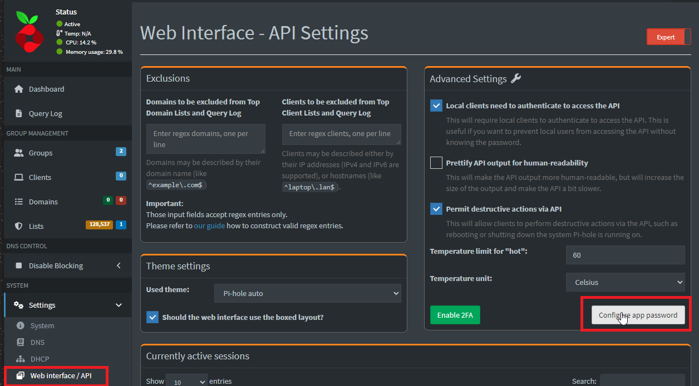
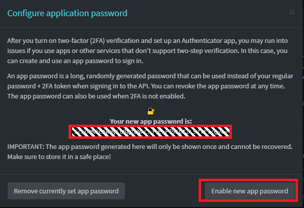

# PiHoleShell

[](https://www.powershellgallery.com/packages/PiHoleShell)
[](https://www.powershellgallery.com/packages/PiHoleShell)
[](https://github.com/mikemadeja/PiHoleShell/actions/workflows/PSScriptAnalyzer.yml)
[](LICENSE)
-blue)

A PowerShell module for automating and scripting against the **Pi-hole v6 REST API** — DNS blocking control, allow/deny lists, groups, stats, and server actions, all from PowerShell.

> This module targets Pi-hole's v6 API only. It will not work against Pi-hole v5 or earlier.

## Table of Contents

- [Features](#features)
- [Requirements](#requirements)
- [Installation](#installation)
- [Getting an API Password](#getting-an-api-password)
- [Quick Start](#quick-start)
- [Command Reference](#command-reference)
- [Testing](#testing)
- [Contributing](#contributing)
- [License](#license)

## Features

- Enable/disable DNS blocking, optionally for a set duration
- Manage allow/deny lists and groups
- Trigger server actions: flush network table, restart DNS, update gravity
- Pull stats, summaries, and diagnostic info
- Every function authenticates and closes its own session automatically — no manual login/logout calls needed

## Requirements

- **PowerShell 7.0+ (Core edition)** — the module refuses to load on Windows PowerShell 5.1 or other editions
- A reachable Pi-hole v6 server and an API app password

## Installation

Install from the [PowerShell Gallery](https://www.powershellgallery.com/packages/PiHoleShell):

```powershell
Install-Module -Name PiHoleShell -Scope CurrentUser
Import-Module -Name PiHoleShell
```

## Getting an API Password

1. Log into your Pi-hole web interface, then go to **Web Interface / API** settings and select **Configure app password**.

   

2. Copy the generated password, then click **Enable new app password**.

   

Keep this password secret — anyone with it has full API access to your Pi-hole.

## Quick Start

```powershell
$PiHoleServer = "https://pihole.example.com:8489"
$Password = "<your-app-password>"

# Check whether blocking is currently enabled
Get-PiHoleDnsBlockingStatus -PiHoleServer $PiHoleServer -Password $Password -IgnoreSsl:$true

# Disable blocking for 5 minutes, then it re-enables automatically
Set-PiHoleDnsBlocking -PiHoleServer $PiHoleServer -Password $Password -Blocking False -TimeInSeconds 300 -IgnoreSsl:$true
```

Every function accepts the same core parameters:

| Parameter | Description |
|---|---|
| `-PiHoleServer` | Base URL of your Pi-hole, e.g. `https://pihole.example.com:8489` |
| `-Password` | The app password from [Getting an API Password](#getting-an-api-password) |
| `-IgnoreSsl` | Skip TLS certificate validation (useful for self-signed certs) |
| `-RawOutput` | Return the unmodified API response instead of a formatted object |

## Command Reference

Functions marked 🚧 are still under active development — signatures and output shapes may change.

### Actions

| Function | Description |
|---|---|
| `Invoke-PiHoleFlushNetwork` | Flush the network table, removing known devices and their addresses |
| `Restart-PiHoleDnsService` | Restart the `pihole-FTL` service |
| `Update-PiHoleActionsGravity` 🚧 | Run `pihole -g` to rebuild the gravity/adlists database |

### DNS Control

| Function | Description |
|---|---|
| `Get-PiHoleDnsBlockingStatus` | Get current blocking status and any active timer |
| `Set-PiHoleDnsBlocking` | Enable or disable blocking, optionally for a set duration |

### Group Management

| Function | Description |
|---|---|
| `Get-PiHoleGroup` | List groups |
| `New-PiHoleGroup` | Create a group |
| `Update-PiHoleGroup` | Update an existing group |
| `Remove-PiHoleGroup` 🚧 | Delete a group |

### List Management

| Function | Description |
|---|---|
| `Get-PiHoleList` 🚧 | List allow/deny lists |
| `Add-PiHoleList` 🚧 | Add a domain to an allow/deny list |
| `Remove-PiHoleList` 🚧 | Remove lists |
| `Search-PiHoleListDomain` | Search all lists for a domain, with optional partial matching |

### Metrics

| Function | Description |
|---|---|
| `Get-PiHoleStatsSummary` | Overview of query, system, and FTL activity |
| `Get-PiHoleStatsRecentBlocked` | Most recently blocked domain |
| `Get-PiHoleStatsQueryType` | Query breakdown by DNS record type |
| `Get-PiHoleStatsTopDomain` | Top permitted/blocked domains |
| `Get-PiHoleStatsTopClient` | Top clients by query volume |

### Configuration & Diagnostics

| Function | Description |
|---|---|
| `Get-PiHoleConfig` 🚧 | Read the Pi-hole configuration |
| `Get-PiHolePadd` 🚧 | Data used to power the PADD dashboard |
| `Get-PiHoleInfoMessage` | Pi-hole diagnosis messages |
| `Get-PiHoleInfoHost` 🚧 | Host system information |

### Authentication

Session handling is automatic for every command above, but these are available for managing sessions directly:

| Function | Description |
|---|---|
| `Get-PiHoleCurrentAuthSession` | List active API sessions |
| `Remove-PiHoleAuthSession` | Revoke a session by ID |

## Testing

The module ships with two kinds of [Pester](https://pester.dev/) tests under `tests/`:

- **Unit tests** (`*.Tests.ps1`) mock the API and run anywhere:

  ```powershell
  Invoke-Pester -Path .\tests -ExcludeTagFilter Integration
  ```

- **Integration tests** (`*.Integration.Tests.ps1`) run against a real Pi-hole server and are skipped automatically unless configured. To run them, copy `tests/IntegrationConfig.example.ps1` to `tests/IntegrationConfig.local.ps1` (gitignored) and fill in your server URL and app password, then run:

  ```powershell
  Invoke-Pester -Path .\tests -TagFilter Integration
  ```

  These make real changes on the target server (they flush the network table, restart DNS, and rebuild gravity) — point them at a test instance, not production, if you'd rather not disrupt it.

## Contributing

This project is still early and growing. Issues, suggestions, and pull requests are welcome — see the 🚧 items in the [Command Reference](#command-reference) above for functions that could use testing or polish.

## License

[Apache License 2.0](LICENSE)
